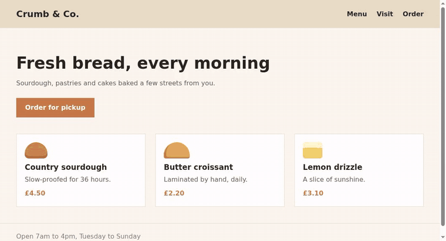
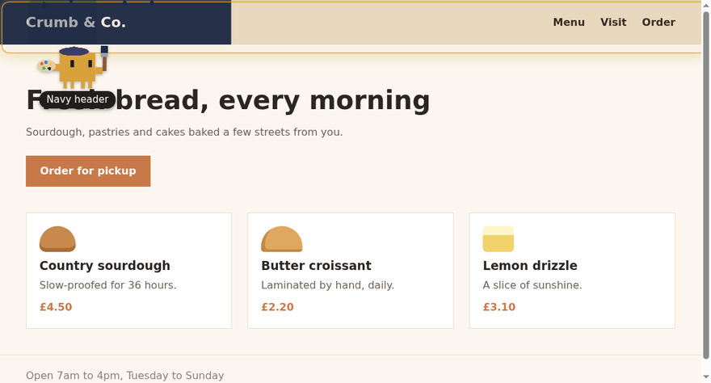
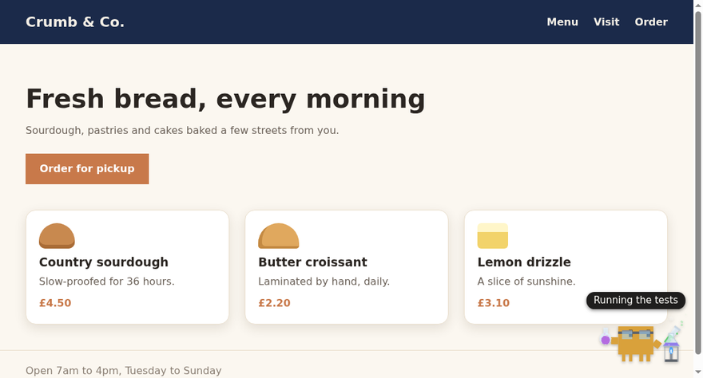
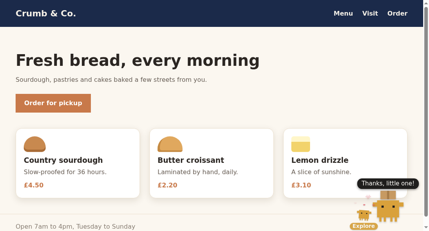
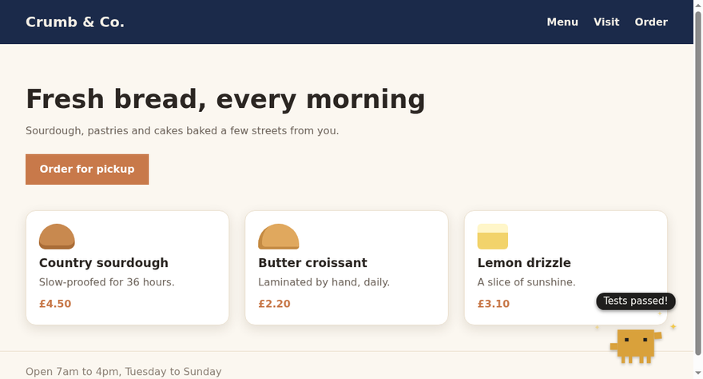

# Live Clawd

**A pixel mascot who acts out what Claude Code is doing, right on the web app you're building.**

When Claude changes your UI, Clawd walks over to the element and paints it, polishes it,
rewrites it or vacuums it up, and the change appears as he works. He runs your tests,
hammers away at builds, forks little helpers for subagents, takes water breaks, sulks when
the page breaks, and waves when Claude needs you.



[Watch the full demo (44 s)](docs/demo.mp4)

---

## What he does

| | |
|---|---|
|  | **Acts out your edits.** Claude tells Clawd where each change shows up and what kind it is (colour, layout, text, a removed element…). He walks there and does it, and the new version is revealed behind his brush. |
|  | **Shows the long, non-visual work.** Tests, builds, installs, git, background jobs and long thinking each get their own animation. Wait long enough and he sits down with a book, then dozes off. |
|  | **Forks helpers for subagents.** Each one toddles off, acts out its own work, and brings him the results. |
|  | **Reacts to how things go.** A fist pump when the tests pass, a facepalm when they fail, a rain cloud while the page is broken, and "Phew!" when it's fixed. |

It's purely cosmetic: it never changes what Claude builds, and Claude doesn't mention it.

## What you need

- **Claude Code** (any recent version with plugins)
- **Node.js** on your `PATH` (the plugin runs a small script with `node`)
- **git** (your project should be a git repository)
- **Firefox** or **Chrome**
- A web project with a **local dev server** (Vite, Next, CRA, Astro… anything on `http://localhost:<port>`)

Works on Linux, WSL (with the browser on Windows) and macOS.

## Install

### 1. The Claude Code plugin

In Claude Code:

```
/plugin marketplace add james1236/live-clawd
/plugin install clawd@live-clawd
```

Then start a new session (or run `/reload-plugins`). The first time Claude uses Clawd it asks
permission for the `clawd` tool; choose **always allow**.

### 2. The browser extension

- **Firefox:** open the signed `live-clawd.xpi` (from the releases page, or whoever shared Live
  Clawd with you) and confirm the install.
- **Chrome:** go to `chrome://extensions`, turn on **Developer mode**, click **Load unpacked**
  and pick the `chrome` folder from the release (or `extension/dist/chrome` if you built it).

Optional: click the Live Clawd toolbar icon and press **Allow** next to *Before-pictures*.
That lets Clawd keep each change hidden until he reveals it. Without it he still acts
everything out, but the change appears straight away.

## Use it

1. Start your project's dev server **from the project's folder** (e.g. `npm run dev`).
2. Open its page (`http://localhost:5173` or whichever port it uses) and keep it visible.
3. Run Claude Code in the same project and ask for a change.

Clawd walks onto the page as soon as Claude starts working. Each Claude session gets its own
Clawd, in its own colour.

### The toolbar icon

The icon is **in colour** on pages Clawd is working on, and **grey** everywhere else. Hover
over it to see why it's grey (no Claude session on this dev server yet, waiting for Claude
Code, muted here, or turned off).

The popup has:

- **Clawd on localhost dev pages**: the main switch (you can also give it a keyboard shortcut
  in your browser's extension shortcut settings)
- **Mute on this site**: keep Clawd off one dev page
- **Sound effects**: chiptune bleeps, only for the tab you're looking at
- **Before-pictures**: the optional permission described above

### Things to try

- **Click Clawd** to tickle him.
- **Hold your cursor near him** and his eyes follow it.
- **Stay on the page during a water break** and he'll throw the empty bottle at your cursor.
  Dodge it if you can.
- When he's **waving a sign**, Claude needs you in the terminal. Click him to send him away.

## Settings

**A dev server Clawd can't find.** Clawd matches the dev servers running from your project's
folder to the localhost tabs you have open. If yours runs somewhere else (Docker, another
folder, a different machine), tell him in `~/.config/live-clawd/config.json`:

```json
{
  "projects": { "~/code/my-app": ["http://localhost:3000"] },
  "ignore": ["~/code/secret-project"]
}
```

`ignore` lists projects Clawd should never appear for.

**Turn him off for one Claude session:** start Claude Code with `CLAWD_LIVE=0`.

**Uninstall:** `/plugin uninstall clawd@live-clawd` in Claude Code, and remove the extension
from your browser.

## Privacy

- Everything stays on your computer. The plugin talks to the extension through a small server
  on `127.0.0.1:47215`. That server only exists while a Claude Code session with the
  plugin is running, and it never connects to the internet.
- Websites you visit can't connect to it or read from it. It only accepts browser
  extensions and programs on your own machine.
- The extension can only see `localhost` pages. The optional *Before-pictures* permission is
  only used to screenshot the visible dev page, for the change Clawd is about to reveal.
- What the extension receives: which tool Claude is using, short captions, file names, and
  the lines that changed in your source files (to work out what to act out). Nothing is
  stored or sent anywhere else.

## Troubleshooting

**The popup says "Waiting for Claude Code".**
No Claude Code session with the plugin is running. Start one (or run `/reload-plugins`), and
check `/plugin` lists `clawd@live-clawd` as enabled. Also check `node --version` works in the
terminal you start Claude Code from.

**The icon stays grey on my dev page.**
Clawd hasn't connected this page to a Claude session yet. It turns colour as soon as Claude
does something in that project. If it never does:
- Make sure the dev server was started from inside the project folder, and the page's port
  is that dev server's (not a proxy in front of it).
- Or add the project to `~/.config/live-clawd/config.json` (see *Settings*).
- Check you haven't muted the site in the popup.

**Claude says "off: no dev server for this project…".**
Same cause as above: start the dev server from the project folder, or add it to the config.
Claude stops calling Clawd for a while after this, then tries again.

**Clawd appears, but never acts out edits (only the general working animations).**
Claude decides when to call the `clawd` tool. Check the tool isn't denied in `/permissions`,
and that the plugin is enabled. Very small or non-visual edits are skipped on purpose.

**WSL: the extension never connects.**
The Windows browser reaches WSL through `localhost` forwarding, which is on by default. If you
turned it off (`localhostForwarding=false` in `.wslconfig`), turn it back on.

**Two Clawds for one session.**
That can happen if you use the same project from two Claude sessions at once. Each
session gets its own Clawd, which is expected.

**No sound.**
Check *Sound effects* is on in the popup, and that the dev page is the tab you're looking at.

## For developers

```
git clone https://github.com/james1236/live-clawd
cd live-clawd
./dev.sh                                   # builds extension/dist/firefox and extension/dist/chrome
claude plugin marketplace add "$PWD"       # use the plugin from this checkout
claude plugin install clawd@live-clawd
```

Load `extension/dist/firefox` via `about:debugging` → *Load Temporary Add-on*, or
`extension/dist/chrome` as an unpacked extension. [CLAUDE.md](CLAUDE.md) explains how the
pieces fit together.

---

Clawd is Anthropic's mascot; this is an unofficial fan project for friends, not an Anthropic
product.
